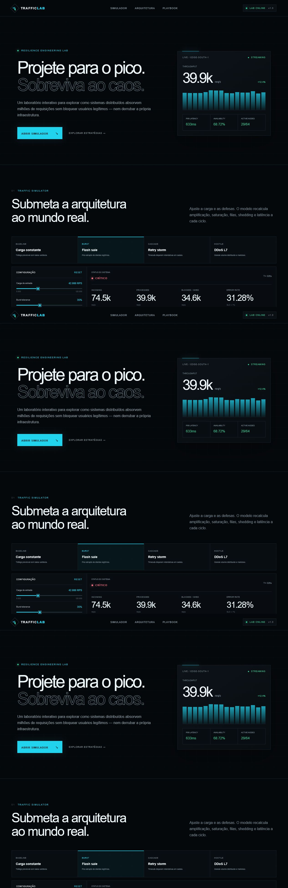
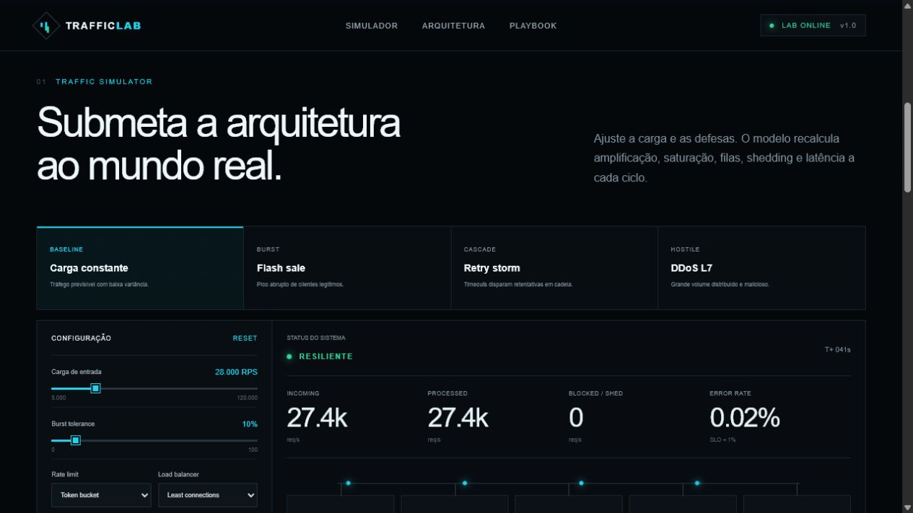
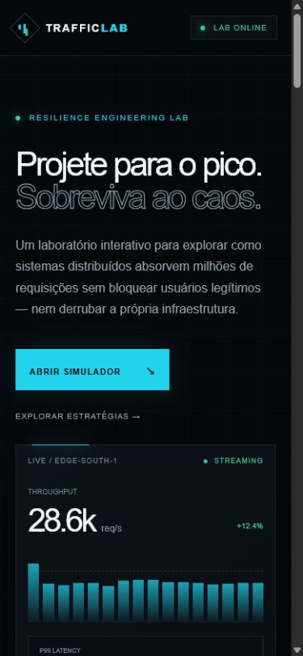

# Traffic Lab

Laboratório interativo de engenharia de resiliência para explorar, de forma segura e explicável, como sistemas distribuídos reagem a carga constante, flash sales, retry storms e ataques de camada 7.

> O Traffic Lab não envia tráfego real e não substitui testes de carga ou capacity planning. O simulador executa um modelo determinístico no navegador para tornar trade-offs arquiteturais observáveis.

## Problema resolvido

Conceitos como admission control, backpressure, circuit breaker e autoscaling costumam ser apresentados isoladamente. O Traffic Lab conecta essas decisões em um único fluxo visual e mostra seus efeitos em throughput, P99, disponibilidade, fila, utilização, bloqueios e instâncias ativas.

## Ideia, público e funcionalidades

O projeto foi concebido como material demonstrativo para desenvolvedores, arquitetos, clientes técnicos e recrutadores. Ele permite:

- alternar entre quatro perfis de carga;
- comparar token bucket, sliding window, fixed window e leaky bucket;
- comparar quatro estratégias de balanceamento;
- ligar e desligar backpressure, circuit breaker, autoscaling e limite adaptativo;
- ajustar carga, burst, capacidade, workers e retries;
- acompanhar telemetria, topologia e incidentes em tempo real;
- consultar um playbook de defesa em profundidade e um modelo de falhas.

## Estado atual e demonstração visual

O projeto está funcional, com build de produção, lint, typecheck, testes unitários e smoke tests automatizados. A interface foi validada sem erros de console em desktop e em viewport móvel.







## Arquitetura e fluxo principal

A aplicação é um site Next.js/React compilado pelo Vinext para um Cloudflare Worker. O estado e o motor do simulador permanecem no cliente; não há API, banco de dados, fila ou integração externa em runtime.

1. O usuário escolhe um cenário e configura controles.
2. `calculateMetrics` combina carga, rate limit, capacidade, fila e mecanismos de proteção.
3. O React atualiza métricas, topologia, gráfico e incidentes.
4. O Worker entrega o shell server-rendered e os assets estáticos.

Veja [visão arquitetural](docs/architecture/overview.md) e [diagramas](docs/diagrams/system.md).

## Tecnologias utilizadas

| Tecnologia | Versão | Responsabilidade | Trade-off |
| --- | --- | --- | --- |
| React | 19.2.6 | UI e estado interativo | Simples para o laboratório, mas concentra a experiência no cliente |
| Next.js | 16.2.6 | App Router, metadados e SSR | Ecossistema amplo; a implantação usa uma camada de compatibilidade |
| Vinext | 0.0.50 | Build Vite compatível com Next.js | Build rápido; classificação estática de rotas ainda é limitada |
| Vite | 8.1.5 | Pipeline de desenvolvimento e build | Excelente DX; o servidor local não deve ser exposto publicamente |
| Cloudflare Worker | via plugin 1.45.1 | Runtime de entrega | Portável no ecossistema Cloudflare, não é um servidor Node genérico |
| TypeScript | 5.9.3 | Tipagem estática | Reduz erros, com custo de uma etapa adicional de validação |

## Estrutura do projeto

```text
app/
  layout.tsx          metadados e shell HTML
  page.tsx            interface e orquestração de estado
  simulation.ts       modelo determinístico e contratos
docs/                 arquitetura, decisões, capturas e relatório
public/og.png         social card
tests/                testes unitários, smoke tests e documentação
worker/index.ts       entrada do Cloudflare Worker
```

## Pré-requisitos e instalação

- Node.js 22.13 ou superior;
- npm compatível com o lockfile.

```bash
git clone https://github.com/Ruuuza/traffic-lab-resilience.git
cd traffic-lab-resilience
npm ci
```

## Configuração e variáveis de ambiente

Não há variáveis obrigatórias. O projeto não recebe credenciais nem dados pessoais. Preferências temporárias e entradas do simulador permanecem no navegador e não são enviadas a terceiros.

## Como executar

```bash
npm run dev
```

Acesse `http://localhost:3000`.

Para executar a versão compilada:

```bash
npm run build
npm start
```

## Execução com Docker

Não há Dockerfile no estado atual. A implantação comprovada utiliza o artefato ESM do Cloudflare Worker; adicionar uma imagem Node sem necessidade aumentaria a superfície operacional.

## Banco de dados, APIs e payloads

Não há banco de dados nem endpoints próprios. O scaffolding D1 não utilizado foi removido durante o grooming. As entradas são controles locais tipados por `Controls`; a saída é o contrato `SimulationMetrics`, ambos definidos em `app/simulation.ts`.

## Testes e qualidade

```bash
npm run lint
npm run typecheck
npm test
npm audit
```

`npm test` compila a aplicação e executa sete testes: três unitários do motor, dois smoke tests do HTML renderizado e dois testes da documentação/evidências. Consulte o [runbook de validação](docs/runbooks/validation.md).

## Observabilidade

A telemetria exibida é parte da simulação e não representa produção. O runtime não exporta logs, métricas ou traces para terceiros. Falhas de build e testes são a observabilidade operacional disponível no repositório.

## Segurança

- nenhum segredo é necessário ou versionado;
- todo o modelo roda localmente, sem enviar tráfego;
- dependências são fixadas no lockfile;
- `npm audit` não reporta vulnerabilidades conhecidas após o grooming;
- a aplicação não possui autenticação, autorização ou entrada HTML arbitrária.

## CI/CD

O deploy é compatível com Sites/Cloudflare Worker por meio de `.openai/hosting.json`. A branch `codex/add-ci` possui um Pull Request separado para integração contínua; até sua revisão/merge, os comandos acima são a fonte de validação reproduzível.

## Decisões técnicas e trade-offs

- [ADR 0001 — modelo determinístico no cliente](docs/decisions/0001-client-side-simulation.md)
- Rejeitar cedo reduz trabalho inútil, mas diminui throughput admitido.
- Filas absorvem picos curtos, mas convertem saturação em latência quando crescem.
- Autoscaling aumenta capacidade com atraso e custo; não substitui admission control.
- A simulação privilegia explicabilidade, não fidelidade estatística de produção.

## Limitações conhecidas

- não há calibração com tráfego real;
- jitter e fórmulas são didáticos;
- a persistência termina ao recarregar a página;
- não há teste E2E contínuo em navegador;
- a classificação de rota exibida pelo Vinext durante o build é indeterminada, sem bloquear o artefato.

## Troubleshooting

Consulte [problemas comuns](docs/troubleshooting/common-issues.md). Em resumo: confirme Node 22.13+, execute `npm ci` e valide novamente com `npm test`.

## Roadmap

- revisar e integrar o PR de CI;
- adicionar testes E2E para interações e acessibilidade;
- permitir exportar configurações locais sem criar backend;
- calibrar cenários com dados públicos, mantendo a distinção entre modelo e medição.

## Como contribuir

Abra uma issue descrevendo problema, evidência e critério de aceite. Trabalhe em branch própria, preserve a natureza segura do laboratório e execute lint, typecheck, testes e auditoria antes do Pull Request.

## Licença

MIT.
