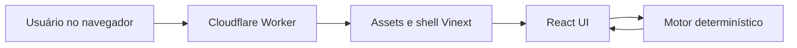
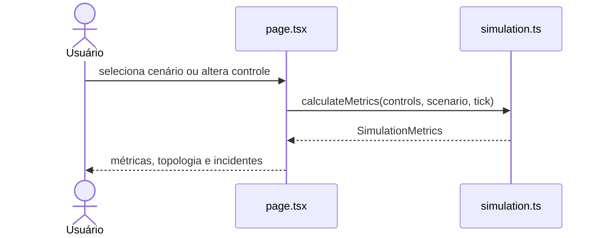
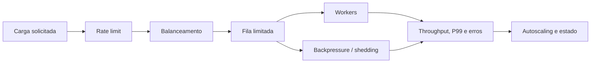

# Diagramas

## Contexto e containers

## Componentes e fluxo principal

## Modelo lógico de resiliência simulado

Os nós representam conceitos calculados no cliente, não infraestrutura real implantada.
